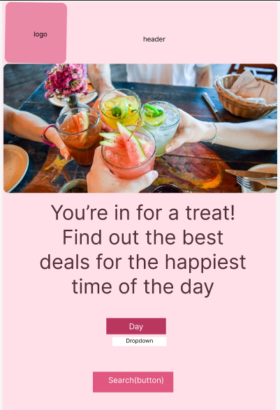
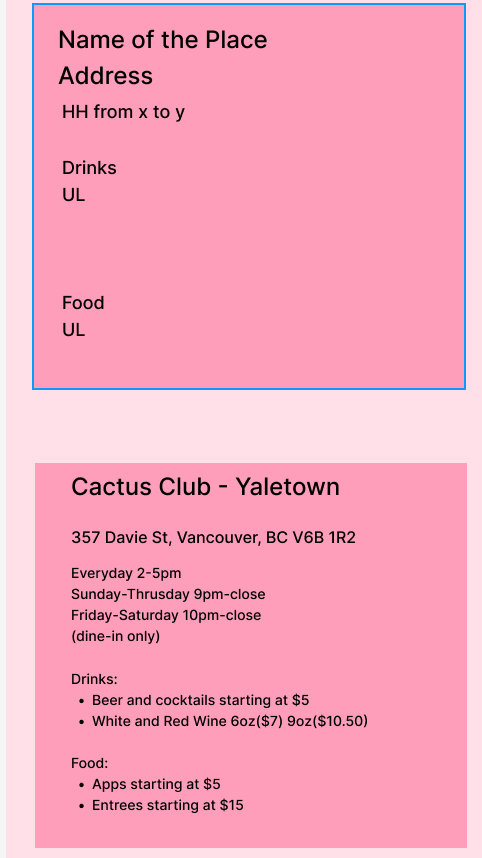

# Project Title

Happy Hour Hunters

## Overview

## What is your app? Brief description in a couple of sentences.

Happy Hour Hunters is an app that helps users find the best happy hour deals in Vancouver. By allowing users to search for deals based on the day of the week, the app consolidates information from various venues to help users save time and money.

### Problem

## Why is your app needed? Background information around any pain points or other reasons.

Finding happy hour deals in Vancouver is currently a hard task. Users often have to visit multiple websites to check menus, happy hour timings, and offers, which can be time-consuming and frustrating. Happy Hour Hunters aims to solve this problem by providing a centralized platform where users can easily find up-to-date information on happy hour deals in Vancouver.

### User Profile

## Who will use your app? How will they use it? Any special considerations that your app must take into account.

Primary Users: Vancouver residents who enjoy going out and are looking to save money by taking advantage of happy hour deals.
Secondary Users: Visitors to Vancouver looking for the best local deals during happy hour.

### Features

List the functionality that your app will include. These can be written as user stories or descriptions with related details. Do not describe _how_ these features are implemented, only _what_ needs to be implemented.

As a user, I want to find places that offer happy hour discounts.
As a user, I want to search by the day of the week.
As a user, I want to see the price of drinks or appetizers during happy hour.

## Implementation

### Tech Stack

Frontend: React, JavaScript, CSS (Sass)
Libraries: react-router, axios, sass,
Backend: Node.js, Express, MySQL
Libraries: express, dotenv, cors, knex
Database: MySQL

### APIs

## List any external sources of data that will be used in your app.

No external APIs will be used for the initial implementation. The app will use a custom MySQL database.

### Sitemap

## List the pages of your app with brief descriptions. You can show this visually, or write it out.

This app will have one page with a dropdown menu. Depending on the day of the week that the user selects, cards with the details about a place will show up on the screen.

### Mockups

### Data

My database will have two tables with the information below:

Places

-id (primary key)
-name
-address
-contact info
-website

Deals

-id (primary key)
-place id (foreign key(placeid))
-day of week
-start and end time
-item
-price

### Endpoints

List endpoints that your server will implement, including HTTP methods, parameters, and example responses.

GET /deals
-Fetch happy hour deals based on selected day.

Parameters:
-day: selected day of the week as a string. ex: Tuesday

I imagine that the response will be something like this:

[
{
"id": 1,
"placeName": "Cactus Club Yaletown",
"items": [
{
"name": "Beer",
"price": 5
},
{
"name": "Fries",
"price": 7
}
],
"time": "5:00 PM - 7:00 PM",
"day": "Monday, Tuesday, Wednesday, Thursday"
},
...
]

### Auth

## Does your project include any login or user profile functionality? If so, describe how authentication/authorization will be implemented.

There won't be user profile functionality.

## Roadmap

May 29 - June 2 -
Initialize React app, create Express server, design database schema and create migrations and seed data.
Create dropdown menu and card display, implement search functionality with dropdown menus on the front end
June 3 - 5:
Develop the GET /deals endpoint to fetch deals based on user selection.
Integrate the backend endpoint with the frontend dropdown menus, test data to ensure correct display on the frontend.
Style the search page and results "page" using Sass.
Day 6 -9:
Ensure the app is responsive and looks good on different screen sizes.
Implement error handling and loading states on the frontend.
Test the search functionality and deal display.
Final test and quality assurance

## Nice-to-haves

Your project will be marked based on what you committed to in the above document. Under nice-to-haves, you can list any additional features you may complete if you have extra time, or after finishing.

- Dropdown by time
- Dropdown by neighborhood
- Pinpoint the places in a map
- Create a POST method where restaurants add their menu in the app
- Create a POST method where users can review the places.
